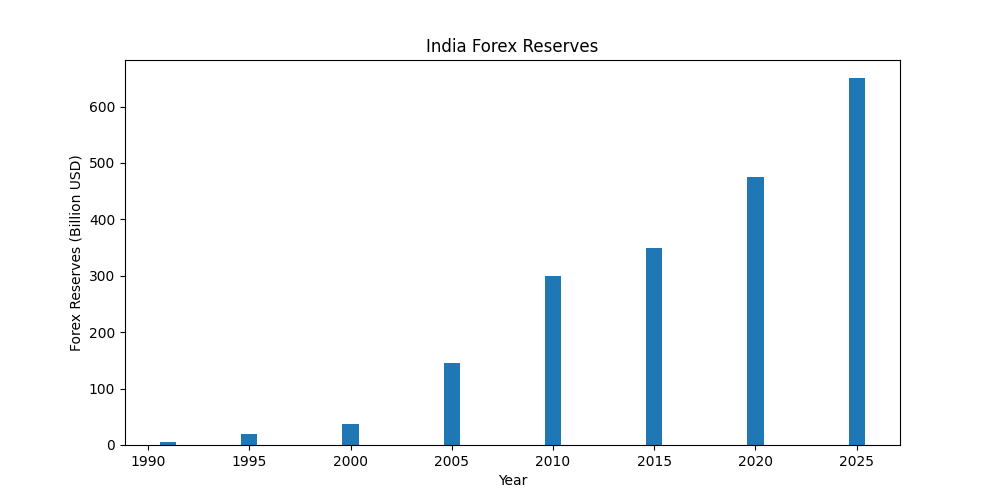
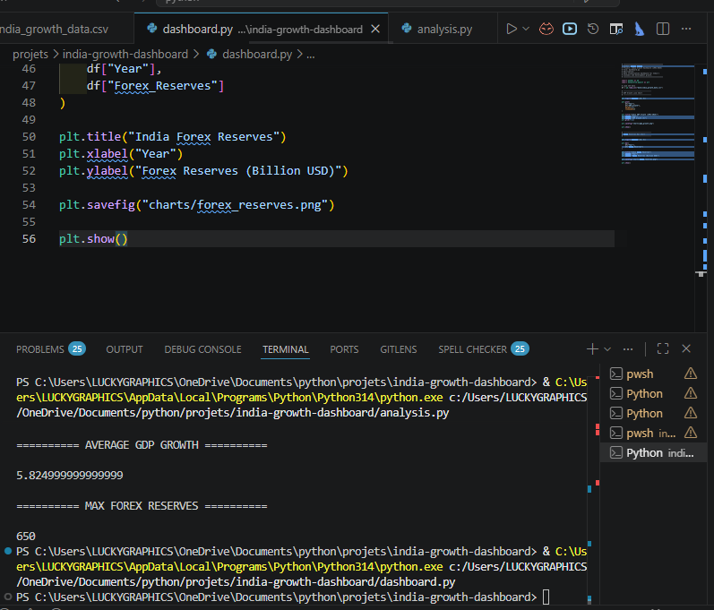

# 🇮🇳 02-1991-Economic-Reforms

# 📊 India Growth & Development Dashboard (1991–2025)

A Python-based economic analytics and visualization project focused on analyzing India's economic transformation after the historic **1991 Economic Reforms** using **Python, Pandas, Matplotlib, NumPy, Statistics, and CSV datasets**.

This project studies India's economic journey from 1991 to 2025 and visualizes major economic indicators like:

- GDP Growth
- Forex Reserve Expansion
- Economic Development Trends
- Statistical Economic Analysis
- Post-Liberalization Growth

The project combines **Economics + Data Analytics + Visualization** to explain how the 1991 reforms transformed India into a rapidly growing economy.

---

# 📚 Historical Background

In 1991, India faced one of the biggest economic crises in its history.

The country suffered from:

- Extremely low foreign exchange reserves
- High fiscal deficit
- Economic slowdown
- Import-export imbalance
- Weak industrial productivity

India had foreign reserves sufficient for only a few weeks of imports.

To save the economy, the Government of India introduced historic reforms under the leadership of:

- Prime Minister P. V. Narasimha Rao
- Finance Minister Dr. Manmohan Singh

These reforms became famous as:

## LPG Reforms

- Liberalization
- Privatization
- Globalization

These reforms opened India's economy to global markets and transformed the country's long-term economic growth.

---

# 🎯 Project Objectives

The major objectives of this project are:

- Analyze India's post-1991 economic growth
- Visualize GDP and forex reserve trends
- Perform statistical economic analysis
- Practice data analytics using Python
- Understand economic liberalization through datasets
- Build real-world analytics dashboards

---

# 🛠 Technologies Used

| Technology | Purpose |
|---|---|
| Python | Core Programming |
| Pandas | Data Analysis |
| Matplotlib | Data Visualization |
| NumPy | Numerical Calculations |
| Statistics | Statistical Insights |
| CSV Files | Dataset Handling |

---

# 📂 Project Structure

```text
india-growth-dashboard/
│
├── 02-1991-economic-reforms/
│   │
│   ├── README.md
│   ├── analysis.py
│   ├── dashboard.py
│   ├── requirements.txt
│   ├── india_growth_data.csv
│   │
│   ├── gdp_growth.png
│   ├── forex_reserves.png
│   └── india-dashboard_terminal_output.png
│
└── README.md
```

---

# 📊 Economic Indicators Included

This project analyzes and visualizes:

✅ GDP Growth Rate  
✅ Forex Reserve Growth  
✅ Economic Development Trends  
✅ Statistical Summary  
✅ Economic Visualization  
✅ Post-Reform Economic Progress  
✅ Liberalization Impact  

---

# 📈 GDP Growth Visualization

The GDP growth chart visualizes India's economic performance after the 1991 reforms.

<p align="center">
  
</p>

### 📌 Insights

- GDP growth improved significantly after reforms
- Economic growth became more stable
- Industrial productivity increased
- India emerged as a major developing economy

---

# 💰 Forex Reserve Visualization

This chart represents India's foreign exchange reserve growth after economic liberalization.

<p align="center">
  
</p>

### 📌 Insights

- Forex reserves increased rapidly
- External financial stability improved
- Import capacity strengthened
- Investor confidence increased globally

---

# 🖥 Analysis Terminal Output

The project performs statistical analysis using Python.

<p align="center">
  
</p>

### 📌 Statistical Outputs

The analysis calculates:

- Maximum GDP Growth
- Average GDP Growth
- Maximum Forex Reserves
- Economic Trend Analysis
- Statistical Summary using Pandas

---

# 📊 Features

## Economic Data Analysis

- GDP Growth Analysis
- Forex Reserve Analysis
- Statistical Calculations
- Economic Trend Analysis
- CSV Dataset Processing

---

## Data Visualization

The project automatically generates:

- GDP Growth Charts
- Forex Reserve Charts
- Economic Trend Visualizations
- Statistical Output Images

All PNG files are generated automatically using Matplotlib.

---

# 📚 Learning Outcomes

This project helps in understanding:

- Economic Liberalization
- India's Growth Journey
- Data Analytics using Python
- Pandas DataFrames
- Statistical Thinking
- Data Visualization
- GitHub Project Structuring
- Economic Research Concepts

---

# 🇮🇳 Importance of 1991 Economic Reforms

The 1991 reforms transformed India by:

- Opening markets to global competition
- Increasing foreign investment
- Encouraging private sector growth
- Improving industrial efficiency
- Expanding exports
- Increasing forex reserves

These reforms are considered one of the biggest turning points in modern Indian economic history.

---

# 📚 Data Sources & References

The project uses educational and publicly available economic references.

## 📊 Sources

- Reserve Bank of India (RBI)
- World Bank Open Data
- International Monetary Fund (IMF)
- Ministry of Finance, Government of India
- MOSPI
- Economic Survey of India

---

# 🏛 Government & Institutional References

The project concept references publicly available information from:

- RBI Reports
- Government Economic Reports
- World Bank Economic Data
- IMF Reports
- Ministry of Finance Publications

---

# 🎓 Learning Purpose

This project is created for:

- Educational Purposes
- Economic Analytics Learning
- Python Practice
- Statistics Learning
- Visualization Practice
- Data Science Projects

This project does not provide investment or financial advice.

---

# ▶️ How to Run the Project

## Step 1 — Install Required Libraries

```bash
pip install -r requirements.txt
```

---

## Step 2 — Run Analysis File

```bash
python analysis.py
```

This script:

- Performs statistical analysis
- Generates economic insights
- Displays summary statistics

---

## Step 3 — Run Dashboard File

```bash
python dashboard.py
```

This script:

- Generates charts automatically
- Saves PNG files automatically
- Creates dashboard visualizations

---

# 🚀 Future Improvements

Possible future upgrades:

- Streamlit Interactive Dashboard
- Real Government Dataset Integration
- Inflation Analysis
- Employment Analysis
- Population Trend Analysis
- AI-Based Economic Predictions
- Advanced Economic Dashboards

---

# 👩‍💻 Author

**Saloni Tiwari**

Python | Data Analytics | Statistics | Economic Visualization

---

# 📜 License

This project is created for educational and learning purposes.

